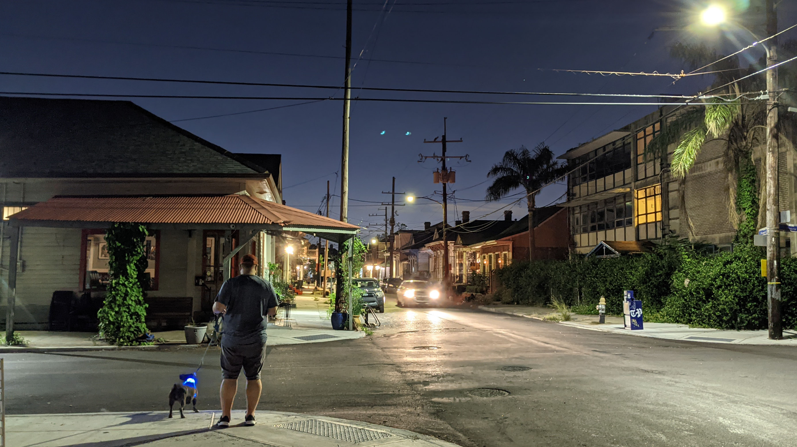

# Hello, folks! 
---

My name is Kurt Karpov and I'm a Software Delivery Specialist and Product Manager. I'm from Detroit, living in New Orleans and currently working at Contino. You can find me on [LinkedIn](https://www.linkedin.com/in/kurtkarpov/).

## &#x270d; Blog & Writing

Apart from coding, I also blog and write on current topics and technologies - you can find my articles on my LinkedIn at [Kurt Karpov](https://linkedin.com/in/kurtkarpov/) as well as on [Medium](https://medium.com/@kurtskarpov).

---
## 🔧 Technologies & Tools

---
## &#x1f4c8; GitHub Stats

<!--      -->

---

<!--
**karpovks/karpovks** is a ✨ _special_ ✨ repository because its `README.md` (this file) appears on your GitHub profile.

Here are some ideas to get you started:

- 🔭 I’m currently working on ...
- 🌱 I’m currently learning ...
- 👯 I’m looking to collaborate on ...
- 🤔 I’m looking for help with ...
- 💬 Ask me about ...
- 📫 How to reach me: ...
- 😄 Pronouns: ...
- ⚡ Fun fact: ...
-->
